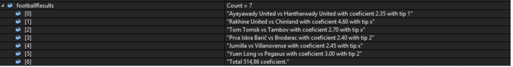

# Web scraper using Google Chrome Selenium and c#

# Scraping finished sport matches (in this case football matches)

# Example scraped data from football matches from 07.04.2018


# Getting the data
sportlife.com.mk is Macedonian betting website and it provides past, current and future sport matches and their coefficients as well.
They are using javascript to load the info so we are using google selenium to load the site.

# Google Chrome Selenium
Download it on https://sites.google.com/a/chromium.org/chromedriver/downloads according to your current Google Chrome version. It must be the same version!
We are loading the selenium with this part of the code:
```
IWebDriver driver = new ChromeDriver(@"C:\chromedriverfolder");
```
My google chrome selenium is located in the folder 'chromedriverfolder' in my C drive.

We are getting only the finished matches with minimumCoef 1.9, you can change this variable to whatever you want
```
var minimumCoef = 1.90;
```

At first we are selecting from which day we want to scrap data from. /option[2] is for yesterday and option[4] is for today. option[3] is live matches and of course they are not finished so we don't need to scrape them.

```
driver.FindElement(By.XPath("//*[@id='prikaz_select']/option[2]")).Click();
```

After selecting the day we are scraping all rows. First we are getting the div with id="template-container_0" because this div
contain the matches for football and after we are getting all elements which have the className="result-row"

```
var divs = driver.FindElement(By.Id("template-container_0")).FindElements(By.ClassName("result-row"));
```
After it we are iterating through the elements.

We are only scraping the matches which started from 11:00 A.M, until 11:00 P.M

```
if ((int.Parse(tmpDiv.First().Text.Substring(0, 2)) >= 11) && int.Parse(tmpDiv.First().Text.Substring(0, 2)) < 23)
```
Again, you can adjuct this as your needs.
